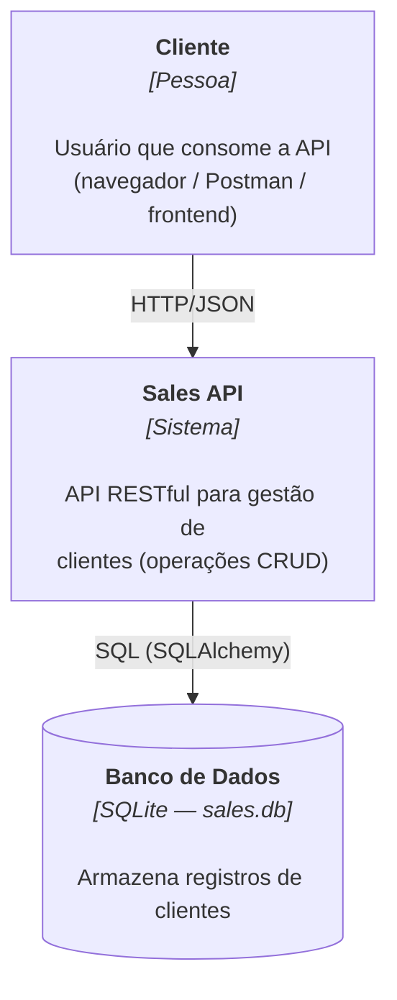
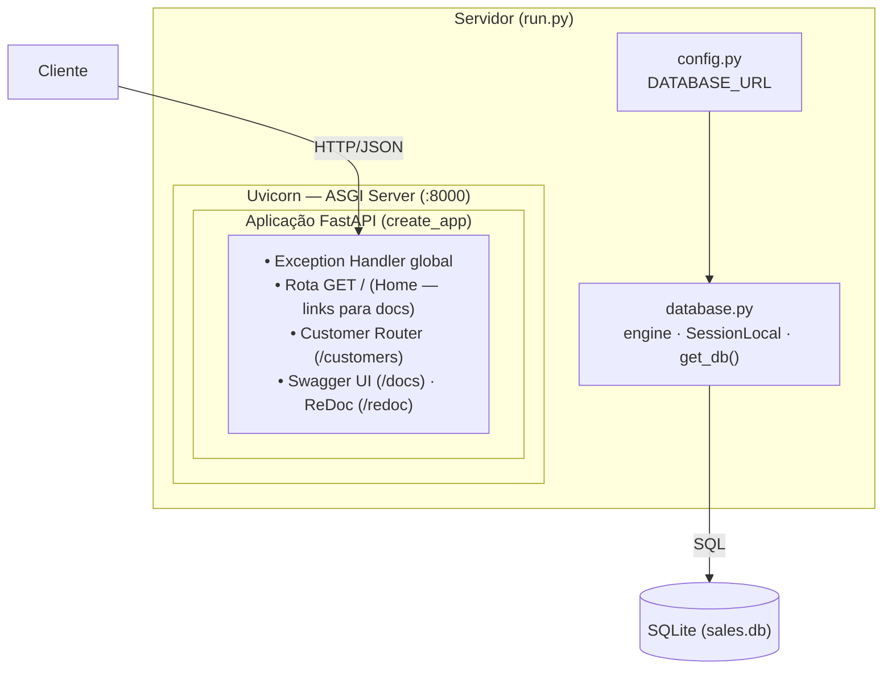
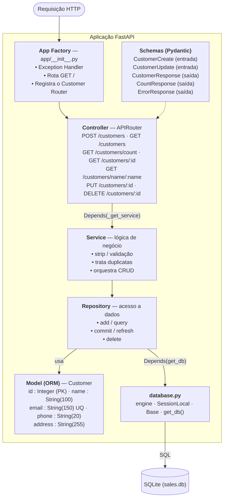
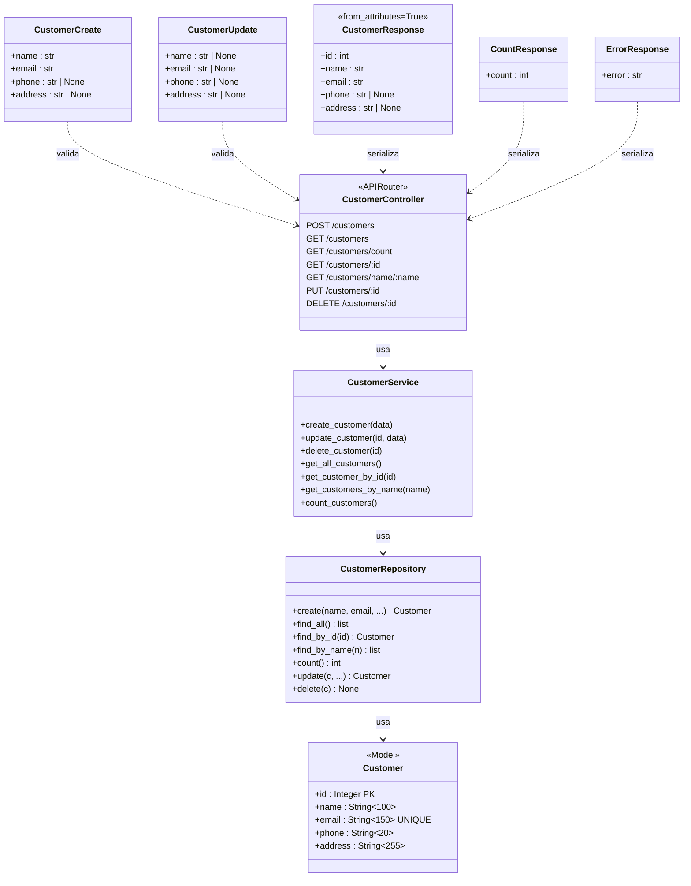
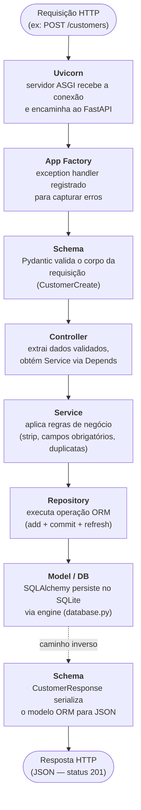

# Sales — API de Clientes

API RESTful seguindo o padrão **MVC** que implementa operações CRUD básicas para os clientes de uma loja.

---

## Índice

1. [Requisitos](#requisitos)
2. [Primeiros Passos](#primeiros-passos)
3. [Estrutura de Pastas](#estrutura-de-pastas)
4. [Arquitetura](#arquitetura)
5. [Referência da API](#referência-da-api)
6. [Executando os Testes](#executando-os-testes)

---

## Requisitos

- Python 3.10+
- pip

---

## Primeiros Passos

```bash
# 1. Crie e ative um ambiente virtual
python -m venv .venv
source .venv/bin/activate       # Windows: .venv\Scripts\activate

# 2. Instale as dependências
pip install -r requirements.txt

# 3. Inicie o servidor (padrão: http://127.0.0.1:8000)
python run.py
```

O arquivo de banco de dados SQLite (`sales.db`) é criado automaticamente na raiz do projeto na primeira execução.

---

## Estrutura de Pastas

```
sales/
├── app/                        # Pacote da aplicação
│   ├── __init__.py             # Fábrica do app (create_app), exception handler, rota home
│   ├── database.py             # Engine SQLAlchemy, SessionLocal, Base e get_db()
│   ├── templates/              # Templates HTML
│   │   └── home.html           # Página inicial com links para /docs e /redoc
│   ├── models/                 # Camada MODEL — definições ORM
│   │   ├── __init__.py
│   │   └── customer.py         # Modelo SQLAlchemy de Customer
│   ├── schemas/                # Schemas Pydantic — validação de entrada e saída
│   │   ├── __init__.py
│   │   └── customer.py         # CustomerCreate, CustomerUpdate, CustomerResponse, …
│   ├── repositories/           # Camada REPOSITORY — acesso a dados (consultas ORM)
│   │   ├── __init__.py
│   │   └── customer_repository.py
│   ├── services/               # Camada SERVICE — lógica de negócio
│   │   ├── __init__.py
│   │   ├── exceptions.py       # Exceções de domínio (NotFoundError, DuplicateError, …)
│   │   └── customer_service.py
│   └── controllers/            # Camada CONTROLLER — rotas HTTP
│       ├── __init__.py
│       └── customer_controller.py  # FastAPI Router /customers
├── tests/                      # Suíte de testes automatizados (pytest)
│   ├── __init__.py
│   └── test_customer.py
├── config.py                   # Configuração (DATABASE_URL via variável de ambiente)
├── requirements.txt            # Dependências Python
├── run.py                      # Ponto de entrada — cria tabelas e inicia Uvicorn
└── README.md
```

### Responsabilidades dos Componentes

| Camada | Pasta / Arquivo | Responsabilidade |
|---|---|---|
| **Model** | `app/models/` | Define o esquema de dados via SQLAlchemy ORM (mapeamento objeto-relacional). |
| **Schema** | `app/schemas/` | Valida entrada e serializa saída com Pydantic (`CustomerCreate`, `CustomerResponse`, etc.). |
| **Controller** | `app/controllers/` | Recebe requisições HTTP, delega ao Service e retorna respostas HTTP. |
| **Service** | `app/services/` | Contém regras de negócio: validação de dados, tratamento de erros e orquestração. |
| **Repository** | `app/repositories/` | Abstrai todas as consultas ao banco de dados via sessão SQLAlchemy. |
| **Database** | `app/database.py` | Cria o engine, a session factory (`SessionLocal`) e fornece `get_db()` para injeção de dependência. |
| **Config** | `config.py` | Carrega variáveis de configuração (`DATABASE_URL`) a partir do ambiente. |
| **View** | Respostas JSON | O FastAPI retorna JSON automaticamente — não há camada de templates HTML. |

> O padrão Repository é adicionado entre o Service e o Model para manter a camada de Service independente da implementação do ORM.

---

## Arquitetura

### C4 — Diagrama de Contexto (Nível 1)



### C4 — Diagrama de Container (Nível 2)



### C4 — Diagrama de Componentes (Nível 3)



### UML — Diagrama de Classes



### Fluxo de uma Requisição



---

## Referência da API

URL Base: `http://127.0.0.1:8000`

### Objeto Customer

```json
{
  "id":      1,
  "name":    "João Silva",
  "email":   "joao@example.com",
  "phone":   "11999990000",
  "address": "Rua das Flores, 123"
}
```

### Endpoints

| Método | Caminho | Descrição |
|--------|---------|-----------|
| `POST` | `/customers` | Criar um novo cliente |
| `GET` | `/customers` | Retornar todos os clientes |
| `GET` | `/customers/count` | Retornar o número total de clientes |
| `GET` | `/customers/{id}` | Retornar cliente por ID |
| `GET` | `/customers/name/{name}` | Retornar clientes que correspondem ao nome |
| `PUT` | `/customers/{id}` | Atualizar um cliente existente |
| `DELETE` | `/customers/{id}` | Excluir um cliente |

#### POST `/customers`

**Corpo** (JSON):

```json
{
  "name":    "João Silva",        // obrigatório
  "email":   "joao@example.com", // obrigatório, único
  "phone":   "11999990000",      // opcional
  "address": "Rua das Flores, 1" // opcional
}
```

Respostas: `201 Created` | `400 Bad Request`

#### GET `/customers`

Respostas: `200 OK` — array de objetos de cliente.

#### GET `/customers/count`

Respostas: `200 OK` — `{"count": 42}`

#### GET `/customers/{id}`

Respostas: `200 OK` | `404 Not Found`

#### GET `/customers/name/{name}`

Busca por substring sem distinção entre maiúsculas e minúsculas.

Respostas: `200 OK` — array de objetos de cliente correspondentes.

#### PUT `/customers/{id}`

**Corpo** (JSON): qualquer subconjunto de `name`, `email`, `phone`, `address`.

Respostas: `200 OK` | `400 Bad Request` | `404 Not Found`

#### DELETE `/customers/{id}`

Respostas: `204 No Content` | `404 Not Found`

---

## Executando os Testes

```bash
pip install pytest
python -m pytest tests/ -v
```